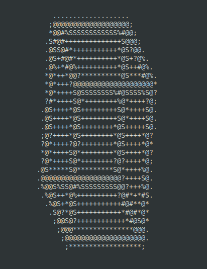
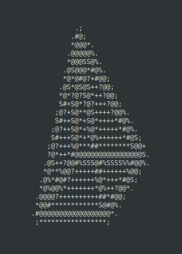

# 3D ASCII Shape

A little ASCII shape render engine for the terminal :)




## Arguments

`python3 main.py cube 40`

1. `<shape>` (required): The type of shape to render. Either `cube` (default) or `pyramid`.

2. `<size>` (required): The size of the shape. This is a numeric value that determines the scale of the shape. Default is `40`.

3. `--x` (optional): The start angle for the X-axis in degrees. Default is `0`.

4. `--y` (optional): The start angle for the Y-axis in degrees. Default is `0`.

5. `--z` (optional): The start angle for the Z-axis in degrees. Default is `0`.

6. `--wireframe` (optional): Render the shape as a wireframe. Default is `False`.

7. `--auto` (optional): Enable automatic rotation of the shape. Default is `False`.

## How It Works

1. **Shape Representation**:

   Each shape (cube, pyramid) is represented using matrices. These matrices define the vertices (points in 3D space) and edges (connections between vertices) of the shape.
   For example, a cube is defined by its 8 vertices and the edges connecting these vertices.

2. **Rotation and Transformation**:

   Rotation is achieved using rotation matrices. Each vertex of the shape is multiplied by these rotation matrices to get the new rotated position.
   https://en.wikipedia.org/wiki/Rotation_matrix

3. **Projection**:

   The 3D coordinates are projected onto a 2D plane by basically just ignoring the z coordinate. This converts the 3D coordinates into 2D coordinates for rendering on a 2D surface.

4. **Rendering with Pillow lib**:

   The Python Imaging Library (PIL) is used to create an image of the shape. The edges of the shape are drawn on a canvas by connecting the projected 2D coordinates of the vertices.
   Then, the faces of the shape are filled with a lighter coloring than the edges (this step is skipped if the `--wireframe` flag is passed).

5. **ASCII Conversion**:

   Once the shape is rendered in an image, the image is converted to grayscale. This helps in calculating the density of each pixel for the shape. The intensity of each pixel is mapped to a corresponding ASCII character from this array:

   ```
   ["@", "#", "S", "%", "?", "*", "+", ";", ":", ".", " "]
   ```

   Darker pixels (higher intensity) are mapped to characters like `#` or `@`, while lighter pixels (lower intensity) are mapped to characters like `.` or ` ` (space).

   And boom, we now have an ASCII representation of the shape.
